# Procesverslag
**Auteur:** Jon Kuijs

https://jonkuijs.github.io/WebsiteJon/

Markdown cheat cheet: [Hulp bij het schrijven van Markdown](https://github.com/adam-p/markdown-here/wiki/Markdown-Cheatsheet). Nb. de standaardstructuur en de spartaanse opmaak zijn helemaal prima. Het gaat om de inhoud van je procesverslag. Besteedt de tijd voor pracht en praal aan je website.

## Bronnenlijst
1.  container scroller https://codeburst.io/how-to-create-horizontal-scrolling-containers-d8069651e9c6
2.  omhoog scroll knop https://www.youtube.com/watch?v=Vef9bxTilCU
3.  Kleur switchen onder producten https://www.youtube.com/watch?v=9Irz0c-6UGw
4.  Form validatie https://developer.mozilla.org/en-US/docs/Learn/Forms/Form_validation
5.  Javascript hamburger menu met hulp van martijn
6.  Zorgen dat buttons op telefoon werken https://css-tricks.com/overriding-default-button-styles/

## Herkansing

## Eindgesprek (week 7/8)

Tijdens week de vakantie had ik aan front-end gemoeten dit heb ik alleen lang niet zoveel gedaan als nodig was het weekend voor dat de lessen weer begonnen moest dit nog allemaal gebeuren ik lever het werk in terwijl ik weet dat ik 2 delen van de surface plane niet heb ook is mijn github een rommel en snap ik er zelf ook niks meer van het grooste probleem javascript is wel gelukt en wat ik heb gedaan is redelijk goed gegaan (denk ik) ik ben simpel weg te laat begonnen en hoop goed advies te krijgen tijdens mijn eindgesprek. De reden dat dit allemaal niet zo goed liep is omdat ik in de vakantie mij er niet toe kon zetten om te beginnen.

hoe heb ik het ervaren

De stijling van basis dingen gingen wel goed en als ik bezig was had ik er ook wel plezier in. Alleen liep ik vaak tegen problemen aan zoals complexe dingen die ik nog nooit heb gedaan en dan ook niet altijd even veel aan het internet had om dat iedereen javascript inline doet. Na lang proberen lukte er wel veel ook al moest dat soms met om wegen en mijn eigen draai hier aan proberen te geven. Overal vond ik het vak wel leuk als het goed ging maar heb ik ook uren naar mijn scherm staan staren terwijl ik er echt niet uit kon komen.

**Screenshot(s):**

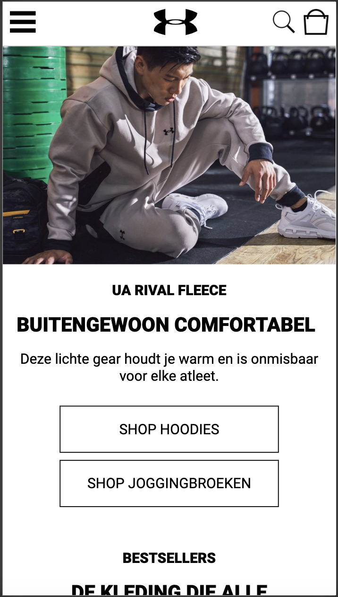
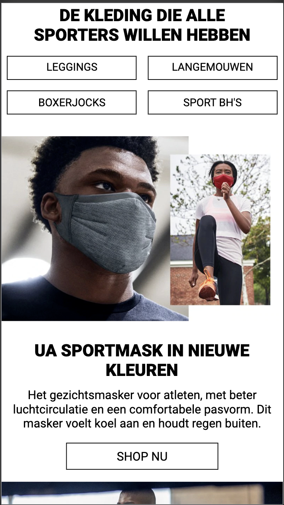
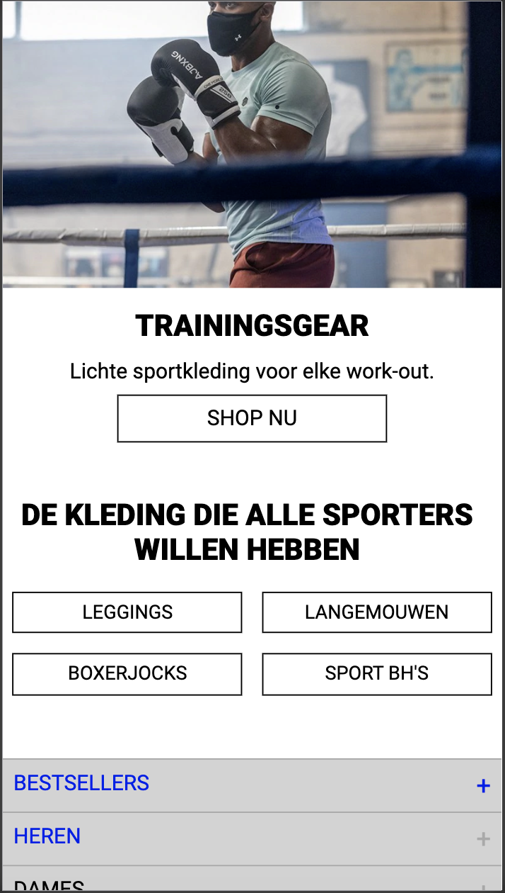
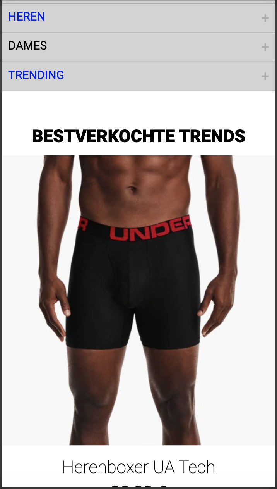
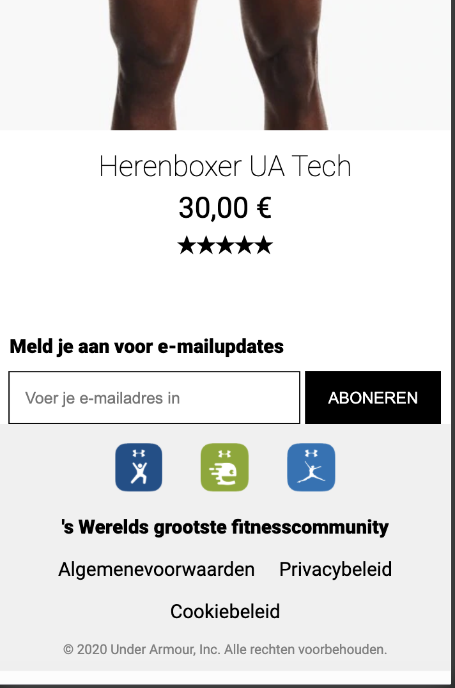
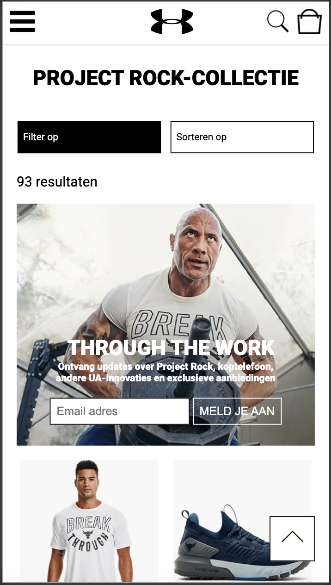
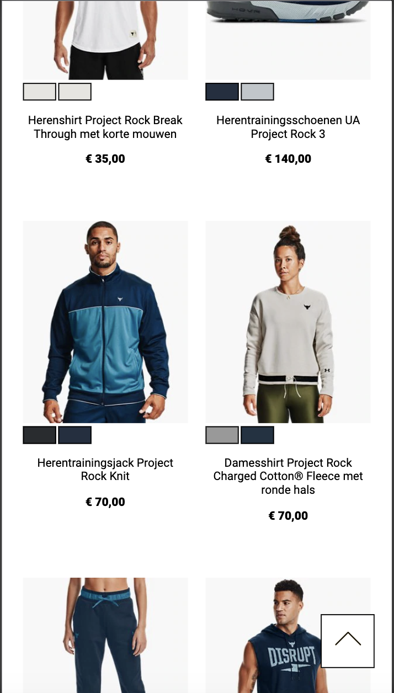
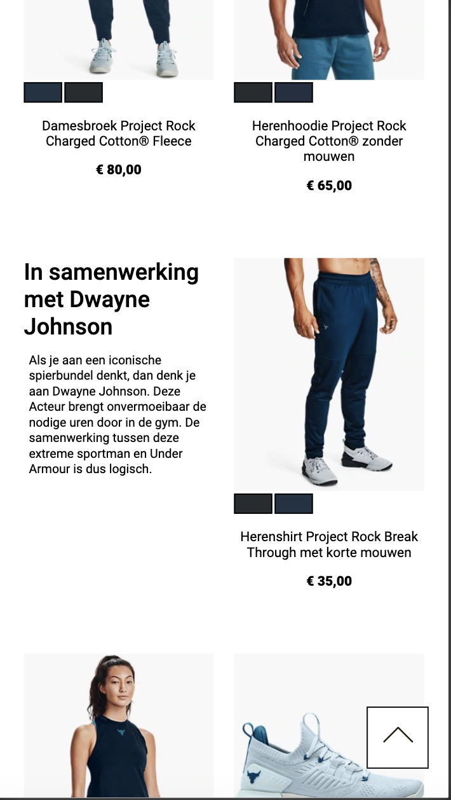
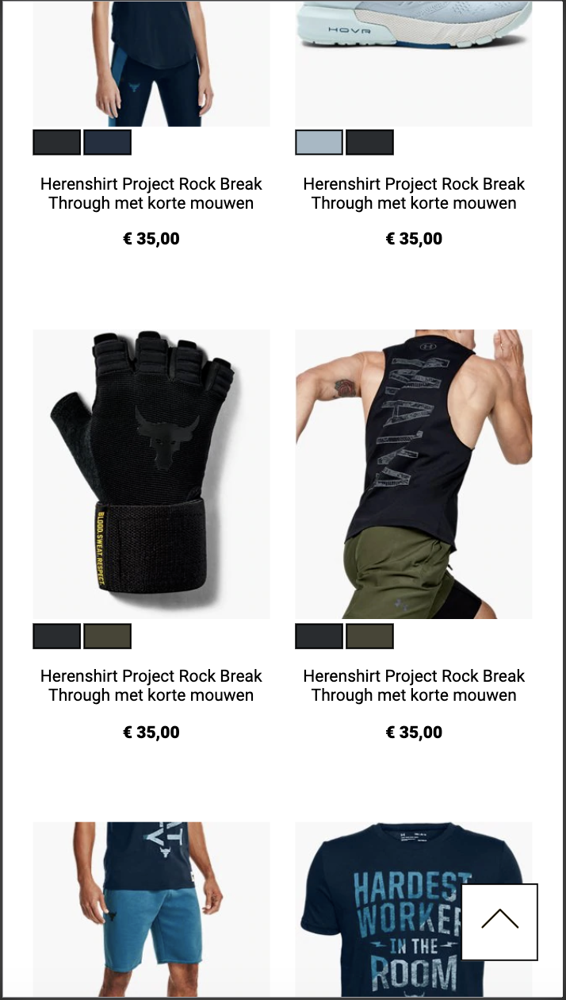
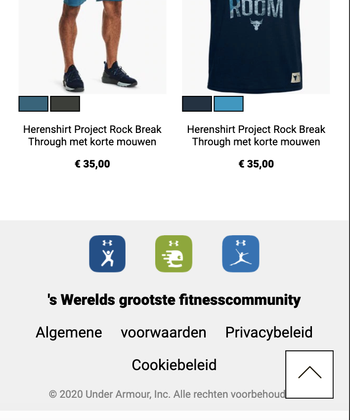

## Voortgang 3 (week 6)
Week 6 heb ik niks gedaan behalve de nav bar gefixed en de links goed gemaakt zodat ze niet meer verkleuren en onder lijnt raken. het is bijna vakantie en door steeds maar te denken het komt wel in de vakantie heb ik alles lekker door geschoven terwijl ik in de vakantie helemaal geen vragen kan stellen dus dit is niet zo handig geplanned en moet ik in de vakantie aan de bak.

Ik heb wel besproken tijdens voortgang 3 wat ik ga doen als surfaceplane dit was het volgende
- Hamburger menu uitklapbaar.  (hamburger menu komt tevoorschijn als je er op klikt.)
- Zoekbalk klapt uit (zoekbalk komt naar beneden als je op het vergroot glas klikt.)
- Email validatie (aan geven als de ingevulde content niet goed is en wanneer dit wel zo is.)
- Kleur veranderen producten ( tussen de kleuren van het product switchen als je op 1 van de kleuren klikt.)
- Pijltje naar boven kant van de pagina. (een pijltje die je boven aan de pagina brengt als je hier op klikt.)

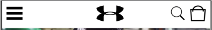
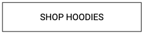

## Voortgang 2 (week 5)
### Stand van zaken
De home pagina heb ik niet aangeraakt en ik ben eigenlijk volledig door gegaan met de tweede pagina het is me hier gelukt om een hele lijst van producten op de pagina te krijgen die automatisch naar onder gaan als ze niet naast elkaar passen. ik heb ook ge experimenteert met kleuren er onder te plaatsen maar kwam nooit verder dan eentje er onder met 2 er onder werdt het nooit mooi. Ook heb ik ook nog niet de image van de rock er onder kunnen zetten ik zit nu te denken aan een background image maar dat moet ik nog proberen. Na de tip om de header in de ul met de rest te zetten heb ik dit nog niet geprobeerd maar hoop ik zo snel mogelijk mee te experimenteren. Wederom heb ik nog niks gedaan aan java en begin ik me steeds meer zorgen te maken hier over omdat ik ook nog zit te twijfelen tussen responsive en surface plane maar responsive begint hoe verder ik door werk steeds lastiger te worden overal was de week best productief voor pagina 2 en staat er een basis maar er moet nog heel veel extra's gebeuren.

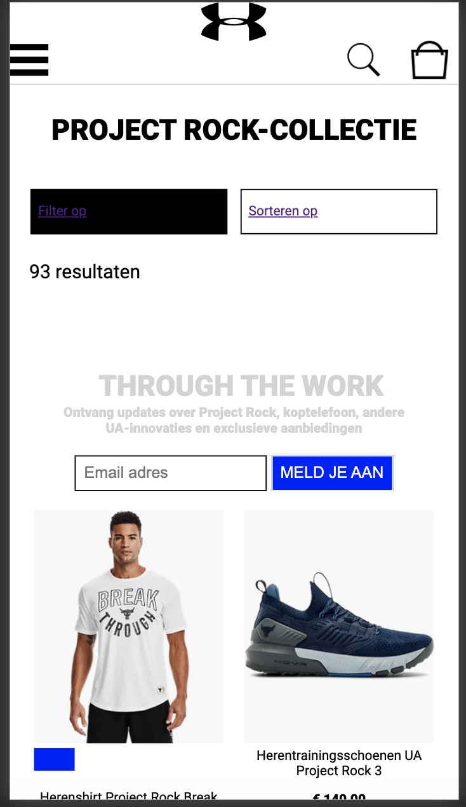

## Voortgang 1 (week 3)

### Stand van zaken
De basis dingen en selectoren gingen goed maar als er nieuwe dingen kwamen was het vaak lastig omdit in de site te krijgen. Ook heb ik minder kunnen maken dan
ik wou de motivatie is laag. De basic layout heb ik al redelijk goed staan van de home page een paar simpele dingen zoals de links fixen dat ze niet meer blauw
en onder lijnt worden. Ik maak me alleen erg zorgen over het javascript deel omdat ik het gebouwt heb met niet echt rekening te houden aan zowel de responsive kant als de surfaceplane zo is het grijzen menutje met BESTSELLERS HEREN DAMES totaal niet goed gemaakt en werkt het alleen op iphone 6/7 ook zijn sommige dingen net niet goed gecentreert terwijl dat wel zou moeten. Het gene waar ik trotst op ben is de carousel waar je door heen kan scrollen die vind ik erg goed gelukt.

**Screenshot(s):**

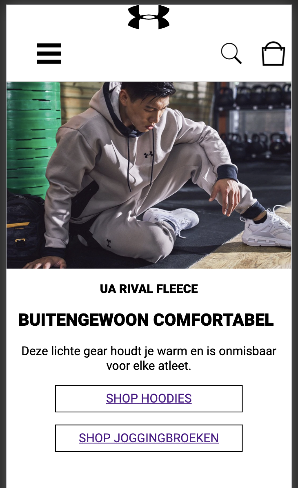
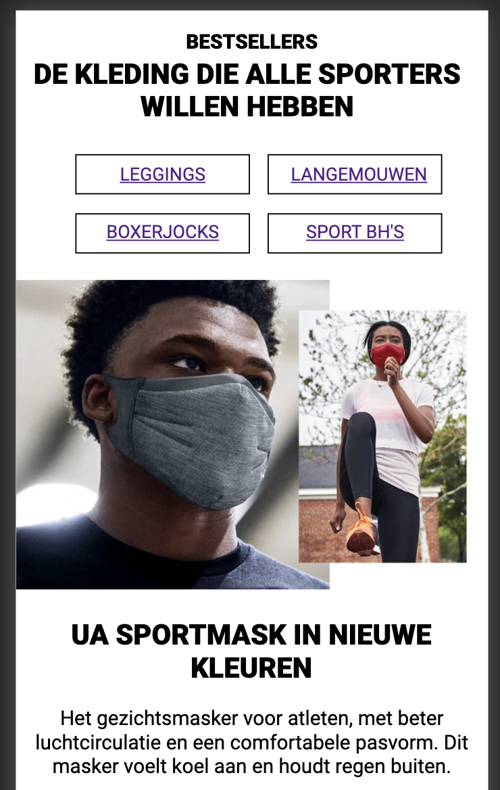
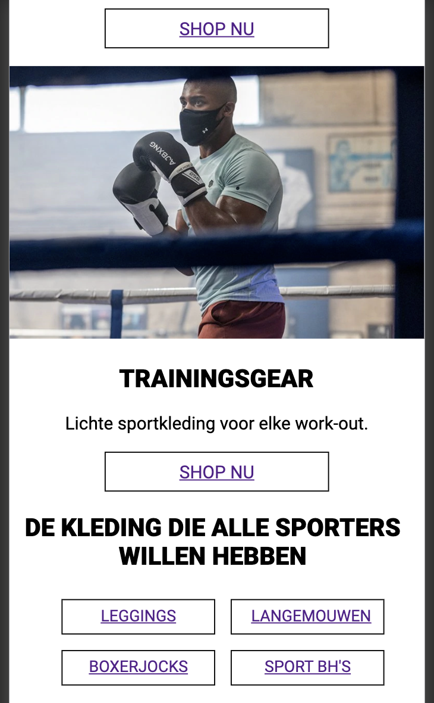
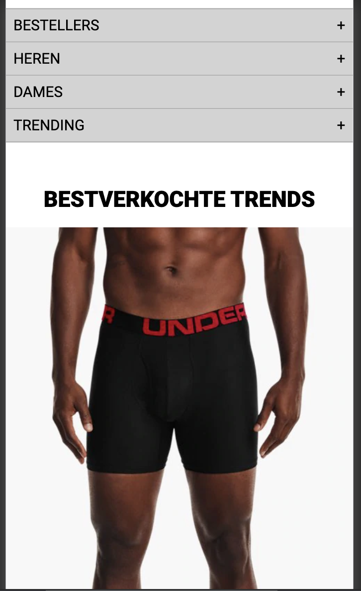
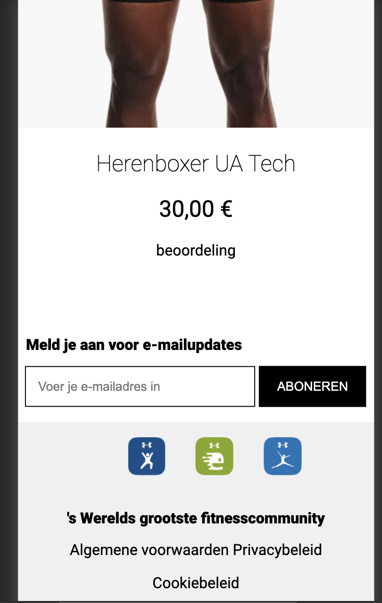

kleine dingen zoals het logo en wit ruimte rechts werkt niet zo goed :(

### Agenda voor meeting
 
-samen met je groepje opstellen-

| Emma | Jon | Charlie | Nine | Martijn |
| --- | --- | --- | --- | --- |
| Waarop letten bij responsive | w3c validator | w3c validator | w3c validator | :nth-of-type |
| font probleem | header probleem | ... | background-image | ... |
| w3c validator | ... | ... | ... | ... |

### Verslag van meeting

Mijn vragen waren dat de w3c validator veel warnings gaf en waarom dit was hier uit bleek dat het niet heel belangrijk was en dat ik gewoon verder kon gaan zodra
het geen errors zouden zijn. Ook had ik een probleem met mijn header dat het logo niet tussen de rest van de iconen kwam de tip was om hier gewoon ervoor te zorgen
dat ik het logo in de list zou zetten net zoals de andere iconen.

## Breakdownschets (week 1)

## Intake (week 1)

**Je startniveau:** blauw

**Je focus:** surface plane

**Je opdracht:** https://www.underarmour.nl/nl-nl/

**Screenshot(s) van de eerste pagina (small screen):**

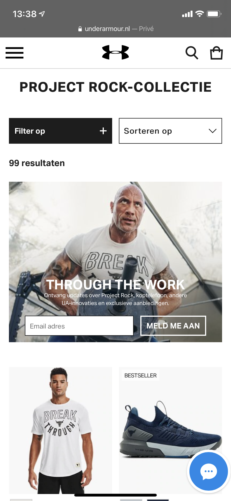

**Screenshot(s) van de tweede pagina (small screen):**

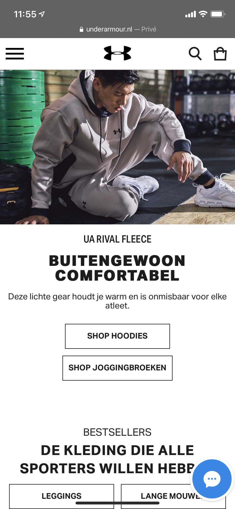
